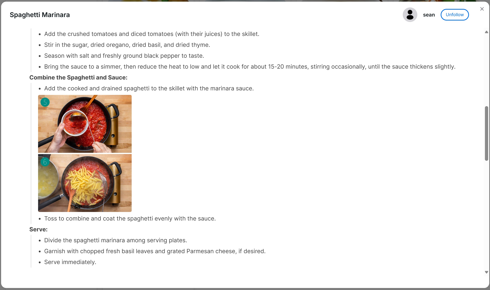
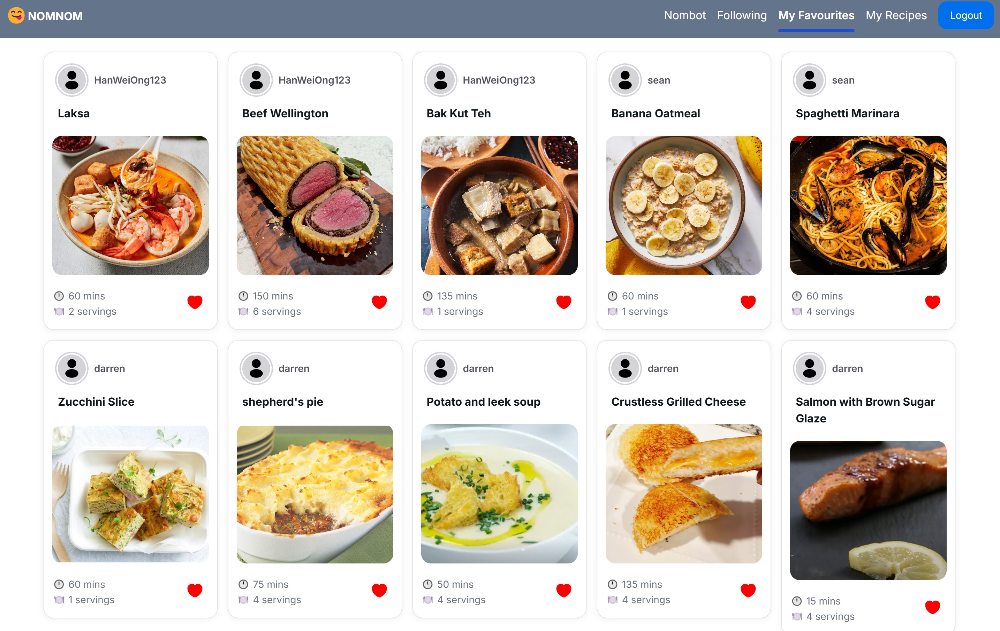

# Nomnom

Nomnom is a web app that helps you to decide what recipes to cook, based on the following problems and solutions:
| Problem | Solution |
|----------|----------|
| Unsure what to cook based on ingredients | Search recipes by ingredients |
| Having to recall past cooked recipes | Create your own recipes, view others' recipes and save them for future reference |
| Explore new recipes | Chatbot to explore new recipes |

## Features

### Recipe Search

Search by ingredients and recipe name

<div align="center">
  
</div>

### Recipe recommendation

Recommends similar recipes based on the recipe ingredients

<div align="center">
  
</div>

### Nombot

Chat with data from recipes

<div align="center">
  
</div>

### Recipe management

Customise your own recipe with a markdown editor that support embedding images and videos, to share with the community and save for your future reference

<div align="center">
  
</div>

### Follow users

Follow users to see their recipes

<div align="center">
  
</div>

### Favouriting recipes

Favourite recipes to view later

<div align="center">
  
</div>

## Technologies

### Frontend

- [Next.js](https://nextjs.org/) - React framework
- [Tailwind CSS](https://tailwindcss.com/) - Utility-first CSS framework
- [NextUI](https://nextui.org/) - UI library
- [Blocknote](https://blocknotejs.org/) - Markdown editor

### Backend

- [Neo4j Graphql](https://neo4j.com/docs/graphql/current/) - Automatic generation of Queries and Mutations for CRUD interactions to Neo4j
- [Neo4j](https://neo4j.com/) - Graph database and support for vector embeddings for RAG (chatbot)

### External Services

- [AWS Amplify](https://docs.amplify.aws/nextjs/) - Library to provision, connect and use the AWS services
  - [AWS Cognito](https://docs.amplify.aws/nextjs/build-a-backend/auth/set-up-auth/) - Manage user credentials, authentication and authorization
  - [AWS Cognito Lambda Trigger](https://docs.amplify.aws/nextjs/build-a-backend/auth/customize-auth-lifecycle/triggers/) - Post confirmation hook to create a user in Neo4j
  - [AWS S3](https://docs.amplify.aws/nextjs/build-a-backend/storage/upload-files/) - Storage for media content e.g. images and videos
- [Langchain](https://js.langchain.com/v0.2/docs/introduction/) - Framework for building applications with LLMs for the chat feature
- [OpenAI](https://platform.openai.com/docs/overview) - GPT 4-o for generating answers to questions and embedding model to generate vector embeddings from recipe text contents
- [Langsmith](https://docs.smith.langchain.com/) - Platform to monitor LLM runs

## Getting Started

First, run the development server:

```bash
npm run dev
# or
yarn dev
# or
pnpm dev
# or
bun dev
```

Update the `.env` file with values from the `.env.sample` file.

Install dependencies

```bash
bun install
```

Start the development server

```bash
bun dev
```

### [Amplify Sandbox Development for AWS Resources](https://docs.amplify.aws/nextjs/deploy-and-host/sandbox-environments/setup/)

Use a personal cloud sandbox environment that provides an isolated development space to rapidly build, test, and iterate on a fullstack app. Each developer on your team can use their own disposable sandbox environment connected to cloud resources.

Deploy to cloud sandbox

```bash
npx ampx sandbox
```

Setting cloud sandbox secret

```bash
npx ampx sandbox secret set <secret-name>
```

Secrets to set

```bash
npx ampx sandbox secret set GOOGLE_CLIENT_ID
npx ampx sandbox secret set GOOGLE_CLIENT_SECRET

npx ampx sandbox secret set NEO4J_URI
npx ampx sandbox secret set NEO4J_USER
npx ampx sandbox secret set NEO4J_PASSWORD
```
